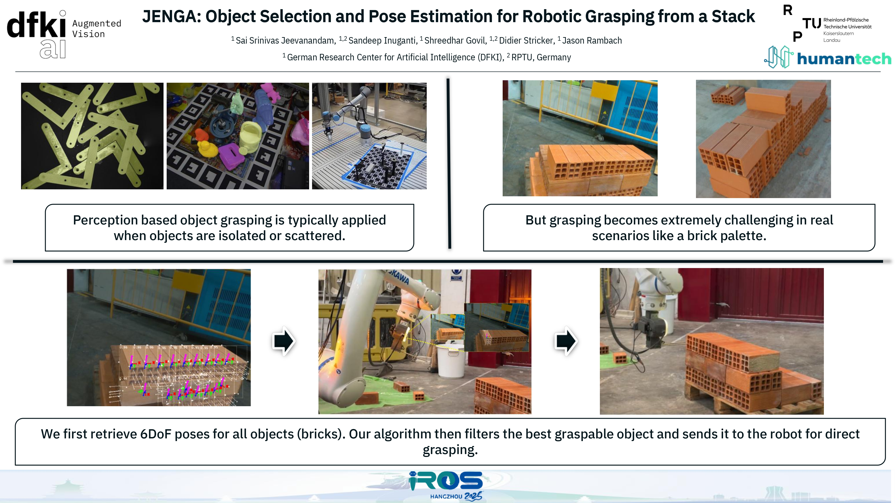

# JENGA IROS 2025

> ⚠️ _Work in progress_ — the codebase will be updated soon with setup instructions and usage details.

## About
This repository contains research code for the JENGA: Object selection and pose estimation for robotic grasping from a stack project (IROS 2025).

## Status
- ✅ Code is present but documentation and setup instructions are pending.
- 🔜 Detailed setup and usage instructions will be added soon.

## DATASET
Dataset can be found here "https://huggingface.co/datasets/dfki-av/JENGA_Dataset/tree/main"

## Visual

